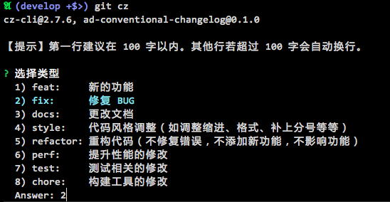
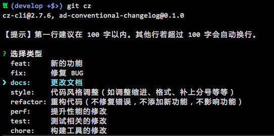

# ad-conventional-changelog

`npm i -D ad-conventional-changelog`

- A [commitizen][] adapter
- 遵循 [AngularJS Git Commit Message](https://docs.google.com/document/d/1QrDFcIiPjSLDn3EL15IJygNPiHORgU1_OOAqWjiDU5Y/edit?pref=2&pli=1#)
- 中文提示符
- 第一行就算超出 100 字也不要紧
- 支持 Breaking Changes
- 支持 Close Issue
- 两种选择方式: rawlist（默认）, list

## 预览

选择类型：



接下来的步骤以及最终结果：


## 切换选择方式

rawlist 方式是只能用数字，不能用方向键的。  
list 方式是可以用方向键或者 jk 键来选择的。

如果你不喜欢默认的 rawlist 选择方式，你可以尝试用 list。

在你的 `package.json` 中设置 `config.commitizen.promptType` 字段，像这样：

```js
  "config": {
    "commitizen": {
      "path": "./node_modules/ad-conventional-changelog",
      "promptType": "list"
    }
  }
```

然后你就会看到这样的界面：



[commitizen]: https://github.com/commitizen/cz-cli
