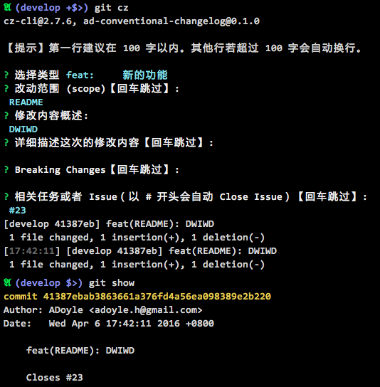

# ad-conventional-changelog
![Node Version][Node Version Image]
[![Npm Package Version][Npm Package Version Image]][Npm Package Version LINK]
[![License][License Image]][License LINK]
![NodeJS Package Dependencies][NodeJS Package Dependencies Link]
[![Build Status][Build Status Image]][Build Status Link]
[![Code Climate][Code Climate Image]][Code Climate Link]
[![Test Coverage][Test Coverage Image]][Test Coverage Link]

- A [commitizen][] adapter
- 遵循 [AngularJS Git Commit Message](https://docs.google.com/document/d/1QrDFcIiPjSLDn3EL15IJygNPiHORgU1_OOAqWjiDU5Y/edit?pref=2&pli=1#)
- 中文提示符
- 第一行就算超出 100 字也不要紧
- 支持 Breaking Changes
- 支持 Close Issue
- 两种选择方式: rawlist（默认）, list

## TOC

<!-- MarkdownTOC -->

- [安装](#安装)
- [预览](#预览)
- [切换选择方式](#切换选择方式)
- [版本](#版本)
- [版权声明 \(Copyright and License\)](#版权声明-copyright-and-license)

<!-- /MarkdownTOC -->


<a name="安装"></a>
## 安装

`npm i -D ad-conventional-changelog`

<a name="预览"></a>
## 预览

选择类型：


接下来的步骤以及最终结果：



<a name="切换选择方式"></a>
## 切换选择方式

rawlist 方式是只能用数字，不能用方向键的。  
list 方式是可以用方向键或者 jk 键来选择的。

如果你不喜欢默认的 rawlist 选择方式，你可以尝试用 list。

在你的 `package.json` 中设置 `config.commitizen.promptType` 字段，像这样：

```js
  "config": {
    "commitizen": {
      "path": "./node_modules/ad-conventional-changelog",
      "promptType": "list"
    }
  }
```

然后你就会看到这样的界面：


<a name="版本"></a>
## 版本

版本迭代遵循 SemVer 2.0.0 的规则。

*但是*，当主版本号是零（0.y.z），一切*随时*都可能有*不兼容的修改*。这处于开发初始阶段，其公共 API 是不稳定的。

关于 SemVer 的更多信息，请访问 http://semver.org/

<a name="版权声明-copyright-and-license"></a>
## 版权声明 (Copyright and License)

Copyright (c) 2016 ADoyle. The project is licensed under the **Apache License Version 2.0**.

See the [LICENSE][] file for the specific language governing permissions and limitations under the License.

See the [NOTICE][] file distributed with this work for additional information regarding copyright ownership.


<!-- Links -->

[LICENSE]: ./LICENSE
[NOTICE]: ./NOTICE
[commitizen]: https://github.com/commitizen/cz-cli

<!-- links -->

[Node Version Image]: https://img.shields.io/node/v/ad-conventional-changelog.svg
[Npm Package Version Image]: https://img.shields.io/npm/v/ad-conventional-changelog.svg
[Npm Package Version LINK]: https://www.npmjs.com/package/ad-conventional-changelog
[License Image]: https://img.shields.io/npm/l/ad-conventional-changelog.svg
[License LINK]: https://github.com/adoyle-h/ad-conventional-changelog/blob/master/LICENSE
[NodeJS Package Dependencies Link]: https://david-dm.org/adoyle-h/ad-conventional-changelog.svg
[Build Status Image]: https://travis-ci.org/adoyle-h/ad-conventional-changelog.svg?branch=master
[Build Status Link]: https://travis-ci.org/adoyle-h/ad-conventional-changelog
[Code Climate Image]: https://codeclimate.com/github/adoyle-h/ad-conventional-changelog/badges/gpa.svg
[Code Climate Link]: https://codeclimate.com/github/adoyle-h/ad-conventional-changelog
[Test Coverage Image]: https://codeclimate.com/github/adoyle-h/ad-conventional-changelog/badges/coverage.svg
[Test Coverage Link]: https://codeclimate.com/github/adoyle-h/ad-conventional-changelog/coverage
